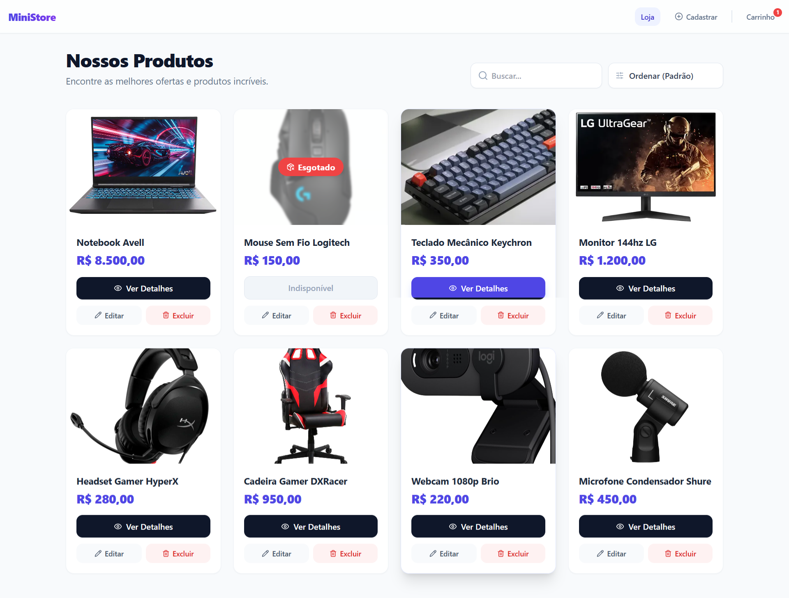
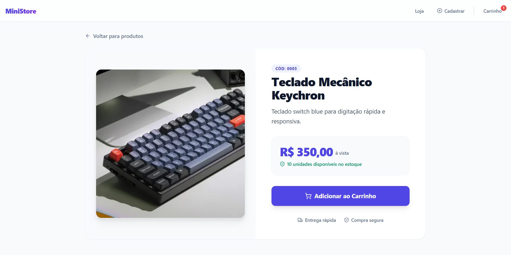
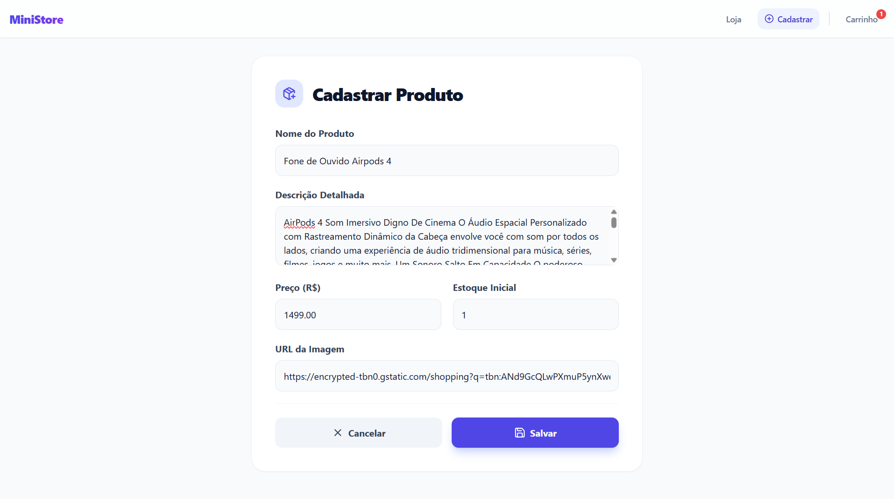
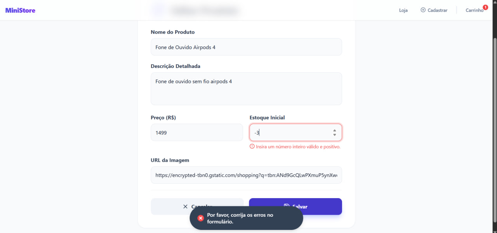
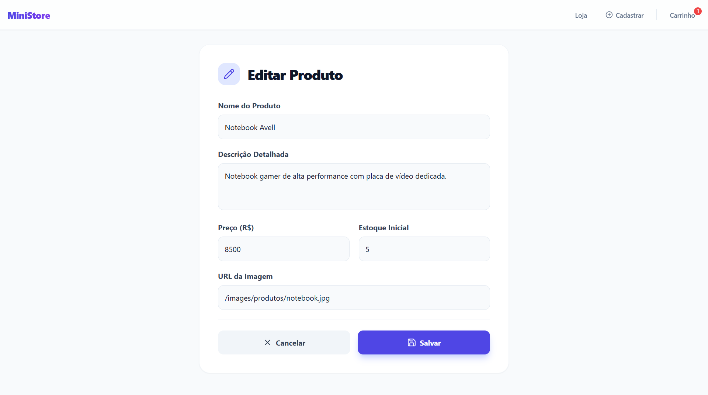
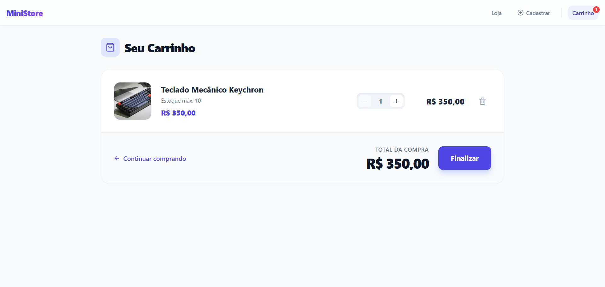
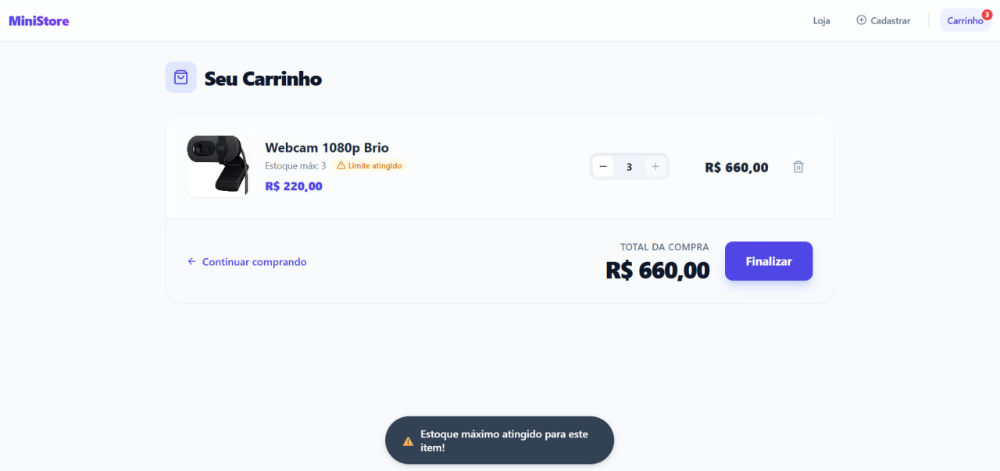

# Documentação Técnica - Mini E-commerce

Esta documentação detalha a arquitetura, funcionalidades e estruturas implementadas no projeto do Mini E-commerce, desenvolvido com React, Vite e TailwindCSS.

## 1. Uso do useContext

O `useContext` foi implementado através do `CartContext.jsx` para gerenciar globalmente o estado do carrinho de compras da aplicação.

- **Como o CartContext foi criado:** Utilizou-se `createContext()` do React. Um componente `CartProvider` foi criado para encapsular toda a lógica e os estados, sendo este renderizado no `main.jsx` ao redor do componente `App`.
- **Quais dados ele armazena:** Armazena um array de objetos `cart`, onde cada item possui propriedades de identificação do produto (id, nome, preco, imagem, estoque) acrescidas da propriedade `quantidade` (quantidade daquele item adicionada ao carrinho). O estado do carrinho é persistido no `localStorage`.
- **Como o carrinho é manipulado:**
  - `addToCart`: Adiciona um novo item ou incrementa a quantidade se já existir. Bloqueia a ação se o limite máximo de estoque do produto for atingido, exibindo um alert.
  - `increaseQuantity`: Incrementa a quantidade de um item em 1, respeitando o limite do estoque daquele produto (botão bloqueado visualmente e validação via lógica).
  - `decreaseQuantity`: Diminui a quantidade de um item, não permitindo que seja menor que 1.
  - `removeFromCart`: Filtra o array, removendo o item pelo ID.
- **Onde é consumido:**
  - Em `Cart.jsx` para listar itens, iterar, atualizar quantidades e remover, e exibir o `getTotal`.
  - Em `ProductDetails.jsx` para validar se já existe a quantidade máxima no carrinho e acionar a função de adição.
  - Em `Header.jsx` para mostrar a quantidade de itens únicos adicionados no ícone de forma reativa.

## 2. Consumo da API (JSON Server)

A persistência de dados é simulada utilizando JSON Server, configurado na porta 3001. A comunicação ocorre em duas frentes: através do hook customizado `useFetch` (para métodos GET reativos) e das funções em `services/api.js` (para mutações e outros gets).

- **Endpoints utilizados:**
  - `GET /produtos`: Traz a lista de todos os produtos.
  - `GET /produtos/:id`: Traz as informações de um produto específico.
  - `POST /produtos`: Cadastra um novo produto na base.
  - `PUT /produtos/:id`: Atualiza todas as informações de um produto existente.
  - `DELETE /produtos/:id`: Exclui um produto pelo ID.

- **Exemplo de requisição:**
  - POST `/produtos`
  - *Corpo:* `{ "nome": "Teclado", "descricao": "Mecânico", "preco": 300, "imagem": "url...", "estoque": 5 }`
  - *Resposta Esperada (JSON):* O mesmo objeto enviado, mas contendo um novo `id` gerado pelo json-server.

- **Tratamento de loading e erro:** Ambas as estratégias (hook e service API) utilizam blocos `try/catch`. O hook `useFetch` atualiza estados `loading` e `error` que são processados visualmente pelos componentes renderizados. Em caso de erro na requisição (response.ok for false), uma exceção é lançada e o `error` state assume a mensagem clara.

- **Configuração JSON Server:** Foi adicionado o pacote `json-server`, e criado um arquivo `db.json` que contém a tabela base de dados `produtos`. O package.json tem o script `"server": "json-server --watch db.json --port 3001"`.

## 3. Estrutura Geral do Projeto

A organização de pastas segue uma padronização funcional do React:
- **`src/components/`**: Componentes reutilizáveis de interface (`Header.jsx`, `ProductCard.jsx`).
- **`src/pages/`**: Componentes principais que formam rotas completas:
  - `Home.jsx`: Tela principal.
  - `ProductDetails.jsx`: Tela de um produto.
  - `Cart.jsx`: Visualização do carrinho e fechamento de compras.
  - `ProductForm.jsx`: Tela adaptável que serve tanto para criar quanto para editar um produto.
  - `NotFound.jsx`: Tratamento genérico para URLs não existentes (Rota curinga `*`).
- **`src/hooks/`**: Onde os hooks customizados da aplicação habitam (como o `useFetch.js`).
- **`src/context/`**: Provedores de contexto globais.
- **`src/services/`**: Concentração de lógica de requests externos (`api.js`).

**Fluxo de navegação (Diagrama ASCII):**
```text
[ Home ] -------------------> [ ProductDetails ]
  | \                              |
  |  \---> [ Cadastro ]            |-> [ Adiciona no Carrinho ]
  |  \---> [ Editar ]              |
  |                                |
  \---> [ Carrinho ] <-------------/
```

## 4. Funcionalidades Implementadas

Foram implementadas todas as funcionalidades descritas nos requisitos:
- **Catálogo:** Listagem responsiva, com ordenação por preço e barra de buscas. Exibe produtos Esgotados visualmente diferenciados.
- **Validação de Estoque:** Impede fisicamente a inserção no carrinho e desativa botões de adição se não há estoque na API (`estoque === 0`), ou se o carrinho do usuário já possui o limite exato correspondente do `estoque` retornado da API.
- **Cadastro e Edição:** Formulário dinâmico utilizando estado controlado. Validações ocorrem no envio: não permite salvar se há erros; caso algum campo dispare o alerta, a borda do input se torna vermelha e o `useRef` aplica foco no primeiro campo com erro da página.
- **Persistência Local (Opcional adicionado):** O `CartContext` utiliza o Local Storage do navegador para salvar o status do carrinho, garantindo que o usuário não o perca em um F5.

## 5. Como Rodar o Projeto

É necessário manter 2 abas/janelas do terminal abertas ao mesmo tempo.

1. **Instalar Dependências**
   ```bash
   npm install
   ```
2. **Rodar o Banco de Dados Fake (JSON Server)**
   ```bash
   npm run server
   ```
   *(Ele ouvirá requisições na porta 3001, não feche este terminal).*

3. **Rodar o Vite (Servidor de Desenvolvimento React)**
   Em um novo terminal, na raiz do projeto:
   ```bash
   npm run dev
   ```
   *(Acesse `http://localhost:5173` no seu navegador).*

## 6. Screenshots Demonstrativos

### Tela inicial (Home) com listagem de produtos

**Legenda:** Página principal exibindo grid de produtos, campo de buscas e produtos disponíveis e esgotados.

### Página de detalhes de um produto

**Legenda:** Página da rota `/produto/:id` com informações expandidas, preço e botão de adicionar.

### Cadastro de produto: formulário preenchido corretamente

**Legenda:** Exemplo da página de cadastro com dados válidos, pronta para ser submetida.

### Cadastro de produto: exemplo de validação com erro exibido

**Legenda:** Disparo de erros do formulário ao tentar salvar dados inválidos, mostrando campo com foco vermelho via useRef.

### Edição de um produto existente

**Legenda:** Página na rota `/editar/:id` preenchendo automaticamente com os dados atuais recebidos via GET no servidor.

### Carrinho com itens adicionados

**Legenda:** Exibição da tela do carrinho usando o Context API, listando itens e somatório de valores.

### Carrinho exibindo a mensagem de estoque máximo atingido

**Legenda:** Validação em ação de bloqueio ao tentar aumentar a quantidade de um item além de seu estoque.

### Página 404

**Legenda:** Feedback visual quando o usuário digita uma URL inválida que não existe no routing.
